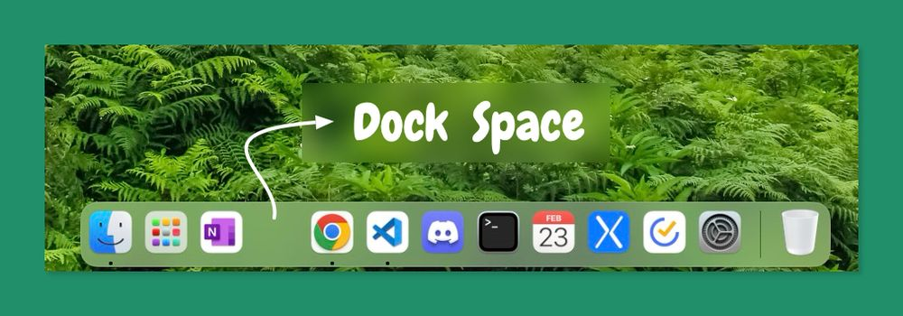

# Dock Space
Since I love simplicity and minimalism, and having empty space is a principle of simplicity, I decided to develop this app for myself to make my dock more efficient and tidy.

In fact, **Dock Space** is a simple app that adds an empty space to the macOS dock so you can give it a better uniformity. This app is made for those who care about details!



## How to use?

1) Just [Download](https://github.com/najafi-saeed/Dock-Space/tree/development/download/dock-space.zip "Download Dock Space") and install it!

> [Download Link](https://github.com/najafi-saeed/Dock-Space/tree/development/download/dock-space.zip "Download Dock Space")

2) If you are a developer, you can build the project package with the following commands:
```bash
npm run package
npm run make
```

## More details:
This repository and application are developed using **electron.js**. Also, **electron forge** is used to build it.

**Electron.js** is an open-source framework that allows developers to build cross-platform desktop applications using JavaScript, HTML, and CSS.

**Electron Forge** is a toolchain for building, packaging, and distributing Electron applications easily. It simplifies the development process by providing a structured workflow.

## Author

- Github:   [@najafi-saeed](https://github.com/najafi-saeed)
- Linkedin: [@najafi-saeed](https://www.linkedin.com/in/najafi-saeed/)